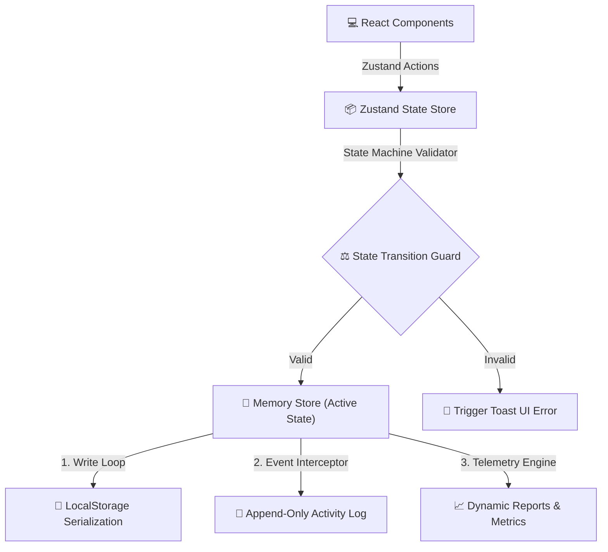

<p align="center">
  
  
  
  
</p>

# RescueHub 🐾

RescueHub is a project used to explore client-side local-first state persistence, workflow state machine validation, and responsive administrative telemetry through a working dashboard built with React, TypeScript, and Zustand.

The project is a personal architectural study focused on client-side state isolation and strict schema constraints rather than a commercial production deployment.


---

## 📌 Project Scope & Reality Check

RescueHub is a product-design and operational dashboard study. It leverages Zustand and `localStorage` to mock an append-only relational dataset locally. The features simulate real-world logistics constraints—such as shelter capacity thresholds, medic logs, and dispatch states—in a self-contained, client-side sandbox.

---

## 🛠️ Tech Stack & State

* **Web Frontend:** React 19 + TypeScript + Vite + Tailwind CSS
* **Navigation Routing:** TanStack Router for type-safe navigation and search parameter synchronization
* **State Engine:** Zustand with custom localStorage serialization middleware for local offline persistence
* **Data Layer:** Relational client-side models tracking Incidents, Cases, Animals, Rescuers, Shelters, and Medical Treatments
* **Audit System:** Automatic, append-only system logging for every state mutation

---

## 📸 Core Workflows & Code Evidence

### 1. Workflow State Machine Validation

```typescript
// Enforcing strict case transition flows inside the Zustand store
// From /src/stores/rescue-hub-store.ts
export const VALID_CASE_TRANSITIONS: Record<RescueCaseStatusType, RescueCaseStatusType[]> = {
  REPORTED: ['ASSIGNED', 'CLOSED'],
  ASSIGNED: ['REPORTED', 'EN_ROUTE', 'CLOSED'],
  EN_ROUTE: ['ASSIGNED', 'RESCUED', 'CLOSED'],
  RESCUED: ['SHELTER_INTAKE', 'CLOSED'],
  SHELTER_INTAKE: ['UNDER_TREATMENT', 'RECOVERED', 'CLOSED'],
  UNDER_TREATMENT: ['RECOVERED', 'CLOSED'],
  RECOVERED: ['ADOPTED', 'RELEASED', 'CLOSED'],
  ADOPTED: ['CLOSED'],
  RELEASED: ['CLOSED'],
  CLOSED: []
}
```

> State transitions are programmatically guarded. Client requests trying to bypass states (e.g., jumping from `REPORTED` straight to `ADOPTED`) are caught and blocked with descriptive mutation errors.

### 2. Relational Aggregates (Dynamic Occupancy Tracking)

```typescript
// Dynamically compute shelter occupancy to avoid schema drift
const currentOccupancy = state.animals.filter(
  (a) => a.shelter_id === shelter.id && a.status === 'Intake' || a.status === 'Under Treatment'
).length;
```

---

## 🧠 Engineering Lessons & Scars

* **Schema Redundancy vs. Computation:** First-version schemas duplicated "current_occupancy" fields inside the `shelter` store. This quickly led to sync mismatches when animals were deleted or updated. Moving to computed aggregates resolved this—shelter occupancy is now calculated on-the-fly from the `animals` store state, guaranteeing a single source of truth.
* **State Machine Guards:** Relying on UI-level logic for state boundaries is error-prone. Implementing the state validation mapping directly within the Zustand action layer ensures that no corrupted state persists to `localStorage`, regardless of UI form configurations.
* **Append-Only Auditing:** Creating a parallel `activityLogs` store that intercepts CRUD actions provides clean database telemetry, mirroring typical backend event sourcing patterns.

---

## 📜 Engineering Principles

* **Offline Resiliency:** App retains fully functional CRUD and analytics tracking even during offline sessions by loading state from a local serialized storage fallback.
* **Type-Safe Boundaries:** Typescript boundaries are strictly enforced across routes, state stores, and layout properties.
* **Single Source of Truth:** Derived data (occupancy rates, outcome metrics) are computed dynamically from primary records to prevent sync drift.

---

## 🏗️ System Architecture

This diagram demonstrates how RescueHub coordinates store states, local storage sync, and component lifecycle events:



---

## 📈 Development Status

### Completed
* **Authentication UI:** Glassmorphic layout with mock session tokens.
* **Telemetry Dashboard:** Analytics telemetry widgets showing recovery rates, adoption rates, active cases, and shelter capacities.
* **Incident Reports CRUD:** Standard interface including geolocation data capture and one-click case promotion.
* **Rescue Cases CRUD:** Workflow state tracking with full rescuer/shelter dispatch assignments.
* **Animals CRUD:** Roster details matching color, breed, and health condition.
* **Rescuers & Shelters Management:** Roster details matching skill lists, availability states, and computed shelter capacity indexes.
* **Treatments Log:** Veterinary diagnostic entries linking back to animal profiles.
* **Activity Logs:** Append-only system audit timeline.
* **Zustand Persistence:** Storage synchronization loop for data durability.

### Not Yet Implemented (Future Roadmap)
* **Supabase Backend Integration:** Migrating from localStorage to PostgreSQL.
* **PostgreSQL RLS Enforcement:** Restricting rescuer views to assigned cases at the database level.
* **File Upload Pipeline:** Storing animal profile photos in Supabase Storage buckets.
* **Native Push Notifications:** Alerting rescuers of new incident dispatches in real-time.
