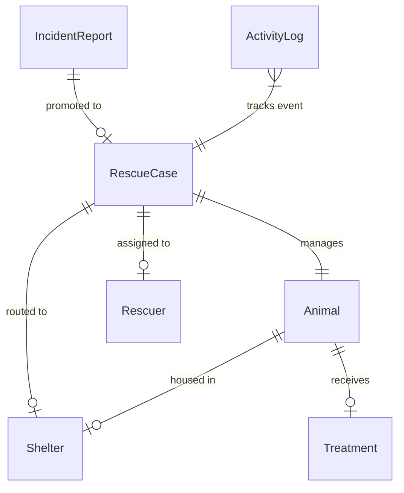
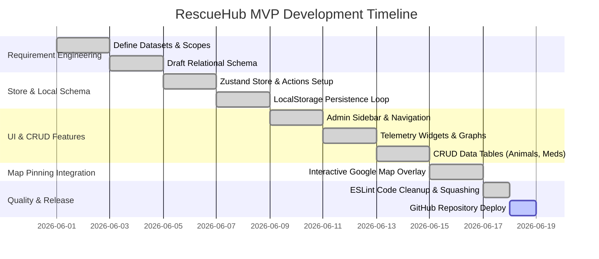

# RescueHub System Design Document & Report

This report outlines the design, architecture, and lifecycle state flow of the **RescueHub Animal Rescue & Case Tracking System**. It documents the functional objectives, relational schemas, validation state machine, and interface modules built into the operational dashboard.

---

## Table of Contents

* [CHAPTER 1: INTRODUCTION](#chapter-1-introduction)
  * [1.1 Rationale](#11-rationale)
  * [1.2 Objectives](#12-objectives)
    * [1.2.1 General Objectives](#121-general-objectives)
    * [1.2.3 Specific Objectives](#123-specific-objectives)
  * [1.3 Scope and Limitation](#13-scope-and-limitation)
    * [1.3.1 Scope](#131-scope)
    * [1.3.2 Limitation](#132-limitation)
* [CHAPTER 2: ANALYSIS AND DESIGN](#chapter-2-analysis-and-design)
  * [2.1 Business Process](#21-business-process)
  * [2.2 Users](#22-users)
  * [2.3 ERD](#23-erd)
  * [2.4 SQL Queries Used](#24-sql-queries-used)
  * [2.5 Functional Requirements](#25-functional-requirements)
  * [2.6 Access and Security Controls](#26-access-and-security-controls)
  * [2.7 Project Schedule (Gantt Chart)](#27-project-schedule-gantt-chart)
  * [2.8 User Interface](#28-user-interface)
* [APPENDICES](#appendices)
  * [Appendix A: Zustand State Schema & Core Types](#appendix-a-zustand-state-schema--core-types)
  * [Appendix B: LocalStorage Persistence Key](#appendix-b-localstorage-persistence-key)

---

## CHAPTER 1

### INTRODUCTION

#### 1.1 Rationale
Animal rescue logistics often suffer from disconnected tracking mechanisms. Citizen incident reports are received through disparate channels, leading to delayed response times. Furthermore, field responders and animal shelters operate as isolated nodes, causing capacity overloads, missing medical histories, and state tracking drift. 

RescueHub resolves these coordination issues. By establishing a unified administrative cockpit, dispatchers can promote citizen incident reports directly into active cases, assign designated responders, route animals to shelters with available capacity, track veterinary medical treatments, and capture operational telemetry—all with client-side local-first durability.

#### 1.2 Objectives

##### 1.2.1 General Objectives
To design and implement a responsive, offline-resilient Case Tracking and Medical Care Management system that integrates incidents, cases, animal profiles, shelter telemetry, and responder assignments into a unified operational database.

##### 1.2.3 Specific Objectives
* Establish a centralized Zustand memory store synchronized with `localStorage` for offline continuous availability.
* Program a strict workflow state machine validation engine to prevent illegal state transitions in case lifecycles.
* Build reactive aggregations for shelter bed capacities to prevent facilities from exceeding capacity limits.
* Create a dedicated medical logging portal tracking veterinary diagnoses, medications, procedures, and check schedules.
* Integrate an interactive geolocation pinning panel using local mock coordinate overlays for rapid dispatch coordinates.
* Deliver telemetry metrics showing active recovery rates, adoption rates, case durations, and clean CSV reports.

#### 1.3 Scope and Limitation

##### 1.3.1 Scope
The system tracks the progress of the animal rescue project, specifically monitoring incident reports, rescue cases, shelter capacities, and veterinary care logs.

**Scope of initial release**
* **Focus on reading/modifying existing project documents:** Users can view, search, and update active rescue cases, animal registers, and medical logs.
* **Time stamps, version control:** Every state change, assignment, or status update dynamically records timestamps and logs changes in the append-only `activityLogs` audit system.
* **Very simple menu-based interface:** Navigation is handled through a straightforward, responsive sidebar menu.

**Scope of subsequent releases**
* **Improve interface:** Integrate advanced dashboard cards, customizable layout themes, and real-time mapping dashboards.
* **Add capability to originate new projects:** Enable dispatchers to create fresh case logs directly or promote incoming citizen incident reports.
* **Add user privilege functionality:** Implement Role-Based Access Control (RBAC) to differentiate permissions between Admin, Dispatcher, Rescuer, and Vet.
* **Allow personnel assignments:** Allow dispatchers to assign field rescuers and select housing shelters for specific rescue cases.

##### 1.3.2 Limitation
* **Tethered Database Model:** RescueHub will be coupled directly with the organization’s central database and does not support multi-tenant configurations for separate external organizations.
* **Communication Modes:** The platform will manage operational logs but will not replace existing communication channels (e.g., phone call hotlines, VHF radios, or email clients).
* **Payment Gateways:** The initial release does not process financial donations, adoption fee transactions, or vet billing directly; it only records audit entries, leaving payment processing to manual workflows.

---

## CHAPTER 2

### ANALYSIS AND DESIGN

#### 2.1 Business Process
The animal rescue operational lifecycle follows a linear path from the moment an animal is spotted in distress until its final case resolution. 

```
Citizen Spots Animal ➔ Submit Incident Report ➔ Dispatcher Review ➔ Promote to Case (Approved)
                                                                            │
Case Closed ↞ Release (Wild) / Adopt (Domestic) ↞ Triage/Treat (If Ill) ↞ Assign Rescuer & Shelter Hub
```

The flowchart below represents the programmatic state pathways of the platform:

<p align="center">
  
</p>

#### 2.2 Users
The system identifies five primary user personas, each interacting with a slice of the system state:

| Persona | Role & Description | Primary System Interactions |
|---|---|---|
| **Citizen Reporter** | Public users reporting distress events. | Submits incident details, locations, and descriptions. |
| **Dispatcher / Admin** | Operational coordinator managing the cockpit. | Reviews reports, promotes cases, assigns field responders, routes to shelters, and tracks telemetry. |
| **Field Rescuer** | Responders executing field retrievals. | Receives dispatches, updates case statuses (`EN_ROUTE`, `RESCUED`), and manages skills profiles. |
| **Shelter Staff** | Managers running housing facilities. | Orchestrates animal check-ins (`SHELTER_INTAKE`) and tracks bed capacity limits. |
| **Veterinarian** | Medical staff prescribing and caring for animals. | Reviews animal conditions, logs medical diagnoses, procedures, and updates recovery states. |

#### 2.3 ERD
RescueHub maintains a relational schema structure simulated inside the Zustand state layer. The diagram below models the entity boundaries and cardinality rules:



#### 2.4 SQL Queries Used
The local Zustand schemas are designed to mirror standard PostgreSQL tables. Below are the DDL schema structures and analytical queries used for report aggregations:

##### 1. Table Definitions (PostgreSQL Schema Structure)
```sql
-- Enforce severity and status lists
CREATE TYPE severity_level AS ENUM ('Low', 'Medium', 'High', 'Critical');
CREATE TYPE case_status AS ENUM ('REPORTED', 'ASSIGNED', 'EN_ROUTE', 'RESCUED', 'SHELTER_INTAKE', 'UNDER_TREATMENT', 'RECOVERED', 'ADOPTED', 'RELEASED', 'CLOSED');
CREATE TYPE animal_status AS ENUM ('Intake', 'Under Treatment', 'Recovered', 'Adopted', 'Released');
CREATE TYPE availability_status AS ENUM ('Available', 'Busy', 'On Leave');

-- Shelters Config Table
CREATE TABLE shelters (
    id VARCHAR(50) PRIMARY KEY,
    name VARCHAR(100) NOT NULL,
    address TEXT NOT NULL,
    contact_person VARCHAR(100) NOT NULL,
    capacity INT NOT NULL,
    created_at TIMESTAMP WITH TIME ZONE DEFAULT CURRENT_TIMESTAMP
);

-- Animals Profile Table
CREATE TABLE animals (
    id VARCHAR(50) PRIMARY KEY,
    name VARCHAR(100) NOT NULL,
    species VARCHAR(50) NOT NULL,
    breed VARCHAR(100),
    sex VARCHAR(20),
    estimated_age VARCHAR(50),
    weight NUMERIC(5,2),
    color VARCHAR(50),
    condition TEXT,
    status animal_status DEFAULT 'Intake',
    photo_url TEXT,
    shelter_id VARCHAR(50) REFERENCES shelters(id) ON DELETE SET NULL,
    case_id VARCHAR(50),
    created_at TIMESTAMP WITH TIME ZONE DEFAULT CURRENT_TIMESTAMP
);

-- Rescuers Roster
CREATE TABLE rescuers (
    id VARCHAR(50) PRIMARY KEY,
    name VARCHAR(100) NOT NULL,
    phone VARCHAR(50) NOT NULL,
    email VARCHAR(100) UNIQUE NOT NULL,
    skills TEXT,
    availability availability_status DEFAULT 'Available',
    created_at TIMESTAMP WITH TIME ZONE DEFAULT CURRENT_TIMESTAMP
);

-- Active Rescue Cases
CREATE TABLE rescue_cases (
    id VARCHAR(50) PRIMARY KEY,
    incident_id VARCHAR(50),
    case_number VARCHAR(20) UNIQUE NOT NULL,
    report_date TIMESTAMP WITH TIME ZONE NOT NULL,
    rescue_date TIMESTAMP WITH TIME ZONE,
    location TEXT NOT NULL,
    description TEXT,
    severity severity_level DEFAULT 'Medium',
    status case_status DEFAULT 'REPORTED',
    rescuer_id VARCHAR(50) REFERENCES rescuers(id) ON DELETE SET NULL,
    shelter_id VARCHAR(50) REFERENCES shelters(id) ON DELETE SET NULL,
    animal_id VARCHAR(50) REFERENCES animals(id) ON DELETE SET NULL,
    notes TEXT,
    created_at TIMESTAMP WITH TIME ZONE DEFAULT CURRENT_TIMESTAMP
);
```

##### 2. Dynamic Shelter Occupancy Calculation (Derived Aggregation)
To avoid sync drift, active occupancy is computed on-the-fly:
```sql
SELECT 
    s.id, 
    s.name, 
    s.capacity,
    COUNT(a.id) AS current_occupancy,
    (s.capacity - COUNT(a.id)) AS available_beds
FROM shelters s
LEFT JOIN animals a ON a.shelter_id = s.id 
    AND a.status IN ('Intake', 'Under Treatment')
GROUP BY s.id, s.name, s.capacity;
```

##### 3. Care Outcome Analytics Query
Computes recovery and adoption rates based on historical data:
```sql
SELECT
    COUNT(*) AS total_animals,
    ROUND(COUNT(CASE WHEN status = 'Recovered' THEN 1 END) * 100.0 / NULLIF(COUNT(*), 0), 2) AS recovery_rate_pct,
    ROUND(COUNT(CASE WHEN status = 'Adopted' THEN 1 END) * 100.0 / NULLIF(COUNT(*), 0), 2) AS adoption_rate_pct
FROM animals;
```

#### 2.5 Functional Requirements
The system implements the following core functional features:

* **FR-1 [Incident Logs]:** Capture citizen report details, including contact details, description, severity, and geolocational markings.
* **FR-2 [Incident Promotion]:** Spawn a validated active Case and initial Animal Profile record directly from an approved incident report.
* **FR-3 [State Machine Enforcement]:** Programmatically guard Case lifecycle states from illegal transitions (e.g. preventing checked-in animals from jumping directly to adoption without recovery steps).
* **FR-4 [Roster & Rescuer Dispatch]:** Track responder availability (`Available`, `Busy`, `Leave`) and register coordinate points on mock maps during assignment.
* **FR-5 [Dynamic Capacity Tracking]:** Aggregate active shelter metrics to avoid housing overflow.
* **FR-6 [Vet Diagnostic Logs]:** Record animal treatments, medical procedures, prescription drugs, and veterinary follow-up dates.
* **FR-7 [Outcome Telemetries]:** Expose telemetry data on recovery rates, open cases, average close times, and download raw table registers in CSV format.

#### 2.6 Access and Security Controls
* **UI Workflow Boundaries:** The state store strictly filters allowed state modifications, blocking requests that bypass operational procedures.
* **Client-Side Auth Guarding:** Verification checks validate active cookie session tokens before mounting authenticated layouts.
* **RLS Policies (Database Roadmap):** Multi-tenant isolation will be enforced directly at the schema layer using PostgreSQL Row Level Security (RLS) policies:
  ```sql
  -- Restrict write access to cases matching assigned organization/node
  ALTER TABLE rescue_cases ENABLE ROW LEVEL SECURITY;
  
  CREATE POLICY "Rescuers can only update cases assigned to their node"
  ON rescue_cases
  FOR UPDATE
  USING (rescuer_id = auth.uid());
  ```

#### 2.7 Project Schedule (Gantt Chart)
The development lifecycle of the RescueHub MVP follows a structured path over six milestones:



#### 2.8 User Interface
* **Authentication Page:** Glassmorphic layout featuring quick demo autofill login selectors.
* **Administrative Telemetry Dashboard:** Top-level widgets displaying Active Cases, Recovery Rates, Adoption Rates, and Shelter Occupancies. Features a bar chart showing incidents by severity and a real-time event feed log.
* ** Roster Grids:** Renders detailed tables with inline filtering, search features, and edit drawer forms.
* **Map Overlay Panel:** A map overlay showing pins for active locations, coordinate selection, and landmark hotspot selectors.

---

## APPENDICES

### Appendix A: Zustand State Schema & Core Types
```typescript
export type SeverityType = 'Low' | 'Medium' | 'High' | 'Critical'
export type IncidentStatusType = 'Pending' | 'Approved' | 'Rejected'
export type RescueCaseStatusType = 'REPORTED' | 'ASSIGNED' | 'EN_ROUTE' | 'RESCUED' | 'SHELTER_INTAKE' | 'UNDER_TREATMENT' | 'RECOVERED' | 'ADOPTED' | 'RELEASED' | 'CLOSED'
export type AnimalStatusType = 'Intake' | 'Under Treatment' | 'Recovered' | 'Adopted' | 'Released'
export type RescuerAvailabilityType = 'Available' | 'Busy' | 'On Leave'

export interface IncidentReport {
  id: string
  reporter_name: string
  report_date: string
  location: string
  description: string
  severity: SeverityType
  status: IncidentStatusType
  created_at: string
}

export interface RescueCase {
  id: string
  incident_id: string | null
  case_number: string
  report_date: string
  rescue_date: string | null
  location: string
  description: string
  severity: SeverityType
  status: RescueCaseStatusType
  rescuer_id: string | null
  shelter_id: string | null
  animal_id: string | null
  notes: string
  created_at: string
}
```

### Appendix B: LocalStorage Persistence Key
RescueHub coordinates client persistence using browser storage under the key:
* **Key Name:** `rescue_hub_db`
* **Format:** JSON-stringified object containing the `incidents`, `cases`, `animals`, `rescuers`, `shelters`, `treatments`, and `activityLogs` arrays.
